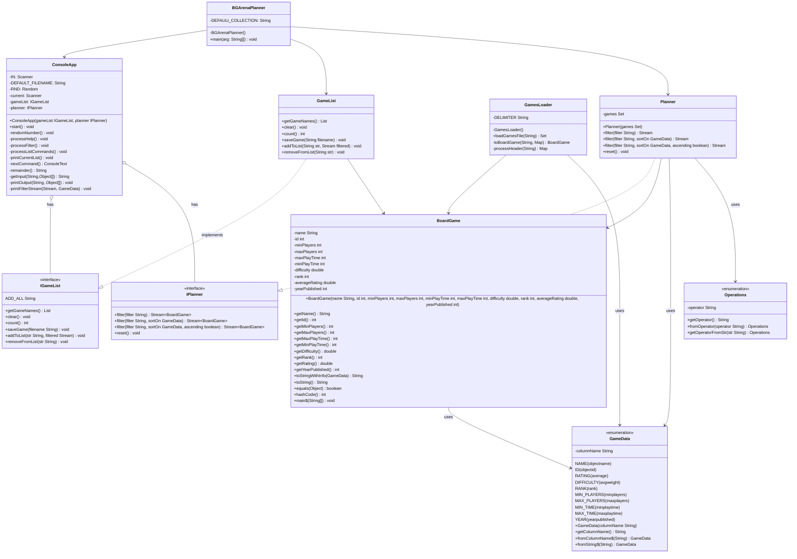

# Board Game Arena Planner Design Document

This document is meant to provide a tool for you to demonstrate the design process. You need to work on this before you code, and after have a finished product. That way you can compare the changes, and changes in design are normal as you work through a project. It is contrary to popular belief, but we are not perfect our first attempt. We need to iterate on our designs to make them better. This document is a tool to help you do that.

## (INITIAL DESIGN): Class Diagram 

Place your class diagrams below. Make sure you check the file in the browser on github.com to make sure it is rendering correctly. If it is not, you will need to fix it. As a reminder, here is a link to tools that can help you create a class diagram: [Class Resources: Class Design Tools](https://github.com/CS5004-khoury-lionelle/Resources?tab=readme-ov-file#uml-design-tools)

### Provided Code

Provide a class diagram for the provided code as you read through it.  For the classes you are adding, you will create them as a separate diagram, so for now, you can just point towards the interfaces for the provided code diagram.

### Your Plans/Design

Create a class diagram for the classes you plan to create. This is your initial design, and it is okay if it changes. Your starting points are the interfaces. 

## (INITIAL DESIGN): Tests to Write - Brainstorm

Write a test (in english) that you can picture for the class diagram you have created. This is the brainstorming stage in the TDD process. 

> [!TIP]
> As a reminder, this is the TDD process we are following:
> 1. Figure out a number of tests by brainstorming (this step)
> 2. Write **one** test
> 3. Write **just enough** code to make that test pass
> 4. Refactor/update  as you go along
> 5. Repeat steps 2-4 until you have all the tests passing/fully built program

You should feel free to number your brainstorm. 

1. Test 1: Test `Planner` that filter() properly filters by name with contains operator
2. Test 2: Test `Planner` that filter() properly handles numeric comparisons
3. Test 3: Test `Planner` that filter() properly sorts results in ascending order
4. Test 4: Test `Planner` that reset() properly clears all filters
5. Test 5: Test `BoardGame` that getName() returns correct name
6. Test 6: Test `BoardGame` that hashCode() is consistent with equals()
7. Test 7: Test `BoardGame` that toStringWithInfo() properly formats output for different GameData types
8. Test 8: Test `GameList` that count() returns 0 when newly created
9. Test 9: Test `GameList` that addToList() properly adds games 

## (FINAL DESIGN): Class Diagram

Go through your completed code, and update your class diagram to reflect the final design. Make sure you check the file in the browser on github.com to make sure it is rendering correctly. It is normal that the two diagrams don't match! Rarely (though possible) is your initial design perfect. 

For the final design, you just need to do a single diagram that includes both the original classes and the classes you added. 

```mermaid
classDiagram
    class BGArenaPlanner {
        -DEFAULt_COLLECTION: String
        -BGArenaPlanner()
        +main(arg: String[]) void
    }
    
    class ConsoleApp {
        -IN: Scanner
        -DEFAULT_FILENAME: String
        -RND: Random
        -current: Scanner
        -gameList: IGameList
        -planner: IPlanner
        +ConsoleApp(gameList IGameList, planner IPlanner)
        +start() void
        -rendomNumber() void
        -processHelp() void
        -processFilter() void
        -processListCommands() void
        -printCurrentList() void
        -nextCommand() ConsoleText
        -remainder() String
        -getInput(String,Object[]) String
        -printOutput(String, Object[]) void
        -printFilterStream(Stream<BoardGame>, GameData) void
    }

    class BoardGame {
        -name String
        -id int
        -minPlayers int
        -maxPlayers int
        -maxPlayTime int
        -minPlayTime int
        -difficulty double
        -rank int
        -averageRating double
        -yearPublished int
        +BoardGame(name String, id int, minPlayers int, maxPlayers int, minPlayTime int, maxPlayTime int, difficulty double, rank int, averageRating double, yearPublished int)
        +getName() String
        +getId() int
        +getMinPlayers() int
        +getMaxPlayers() int
        +getMaxPlayTime() int
        +getMinPlayTime() int
        +getDifficulty() double
        +getRank() int
        +getRating() double
        +getYearPublished() int
        +toStringWithInfo(GameData) String
        +toString() String
        +equals(Object) boolean
        +hashCode() int
    }

    class GameData {
        <<enumeration>>
        NAME(objectname)
        ID(objectid)
        RATING(average)
        DIFFICULTY(avgweight)
        RANK(rank)
        MIN_PLAYERS(minplayers)
        MAX_PLAYERS(maxplayers)
        MIN_TIME(minplaytime)
        MAX_TIME(maxplaytime)
        YEAR(yearpublished)
        -columnName String
        +GameData(columnName String)
        +getColumnName() String
        +fromColumnName$(String) GameData
        +fromString$(String) GameData
    }
    
    class Operations {
        <<enumeration>>
        EQUALS(=)
        NOT_EQUALS(!=)
        GREATER_THAN(>)
        LESS_THAN(<)
        GREATER_THAN_EQUALS(>=)
        LESS_THAN_EQUALS(<=)
        CONTAINS(:)
        -operator String
        +Operations(operator String)
        +getOperator() String
        +fromOperator$(operator String) Operations
        +getOperatorFromStr$(str String) Operations
    }

    class IGameList {
        <<interface>>
        ADD_ALL String
        +getGameNames() List<String>
        +clear() void
        +count() int
        +saveGame(filename String) void
        +addToList(str String, filtered Stream<BoardGame>) void
        +removeFromList(str String) void
    }
    
    class IPlanner {
        <<interface>>
        +filter(filter String) Stream~BoardGame~
        +filter(filter String, sortOn GameData) Stream~BoardGame~
        +filter(filter String, sortOn GameData, ascending boolean) Stream~BoardGame~
        +reset() void
    }
    
    class GameList {
        -listOfGames Set<BoardGame>
        +GameList()
        +getGameNames() List<String>
        +clear() void
        +count() int
        +saveGame(String filename) void
        +addToList(String str, Stream<BoardGame> filtered) void
        +removeFromList(String str) void
    }

    class Planner {
        -games Set<BoardGame>
        -filterConditions List<String>
        +Planner(games Set<BoardGame>)
        +filter(filter String) Stream<BoardGame>
        +filter(filter String, sortOn GameData) Stream<BoardGame>
        +filter(filter String, sortOn GameData, ascending boolean) Stream<BoardGame>
        -filterSingle(filter String, filteredGames Stream<BoardGame>) Stream<BoardGame>
        +reset() void
    }
    
    class GamesLoader {
        -DELIMITER String
        -GamesLoader()
        +loadGamesFile(String) Set<BoardGame>
        -toBoardGame(String, Map<GameData,Integer>) BoardGame
        -processHeader(String) Map<GameData,Integer>
    }
    
    class Filters {
        <<utility>>
        -Filters()
        +filter$(game BoardGame, column GameData, op Operations, value String) boolean
        +filterString$(gameData String, op Operations, value String) boolean
        +filterInt$(gameData int, op Operations, value String) boolean
        +filterDouble$(gameData double, op Operations, value String) boolean
    }
    
    class GameSorter {
        <<utility>>
        +getComparator$(sortOn GameData, ascending boolean) Comparator<BoardGame>
        -getBaseComparator$(sortOn GameData) Comparator<BoardGame>
    }

    BGArenaPlanner --> ConsoleApp : creates
    BGArenaPlanner --> GameList : creates
    BGArenaPlanner --> Planner : creates
    ConsoleApp o-- IGameList : has
    ConsoleApp o-- IPlanner : has
    
    GameList ..|> IGameList : implements
    Planner ..|> IPlanner : implements
    
    GameList "1" *-- "many" BoardGame : contains
    Planner --> BoardGame : processes
    
    Planner --> Filters : uses
    Planner --> GameSorter : uses
    GamesLoader --> BoardGame : creates
    
    Planner --> Operations : uses
    Filters --> Operations : uses
    BoardGame --> GameData : uses
    GameSorter --> GameData : uses
    Filters --> GameData : uses
    GamesLoader --> GameData : uses

```

> [!WARNING]
> If you resubmit your assignment for manual grading, this is a section that often needs updating. You should double check with every resubmit to make sure it is up to date.

## (FINAL DESIGN): Reflection/Retrospective

> [!IMPORTANT]
> The value of reflective writing has been highly researched and documented within computer science, from learning to information to showing higher salaries in the workplace. For this next part, we encourage you to take time, and truly focus on your retrospective.

Take time to reflect on how your design has changed. Write in *prose* (i.e. do not bullet point your answers - it matters in how our brain processes the information). Make sure to include what were some major changes, and why you made them. What did you learn from this process? What would you do differently next time? What was the most challenging part of this process? For most students, it will be a paragraph or two. 

Looking back at how I changed the design, I knew that I took lots of time to design the initial diagram, so it looks already good and complete for me, but I still added and changed some parts. I started with the original diagram and added several important classes. The most significant additions were the Filters class, the GameSorter class, and updating the Planner and GameList implementations.

When I added the Filters class, I created a utility class that handles all the filtering logic for different data types. This was important because it separates the filtering logic from the Planner class, making the code more modular. The GameSorter class was another key addition that implements different sorting strategies using the Strategy pattern, which makes it easy to sort games by different criteria. 

I also enhanced the Planner class by adding the filterConditions field to track active filters and the filterSingle method to process individual filter conditions. This improved the class by allowing filters to be applied sequentially while maintaining state between calls.

For the GameList class, I added the listOfGames field and implementation details for managing the collection of games. This made the relationship between GameList and BoardGame more explicit, showing that GameList contains multiple BoardGame objects.

The most challenging part was figuring out how all these new classes connected to the existing ones. I had to think carefully about which classes use each other and what kind of relationships they have. Organizing everything in a way that shows these relationships clearly without making the diagram too cluttered was tough but satisfying.